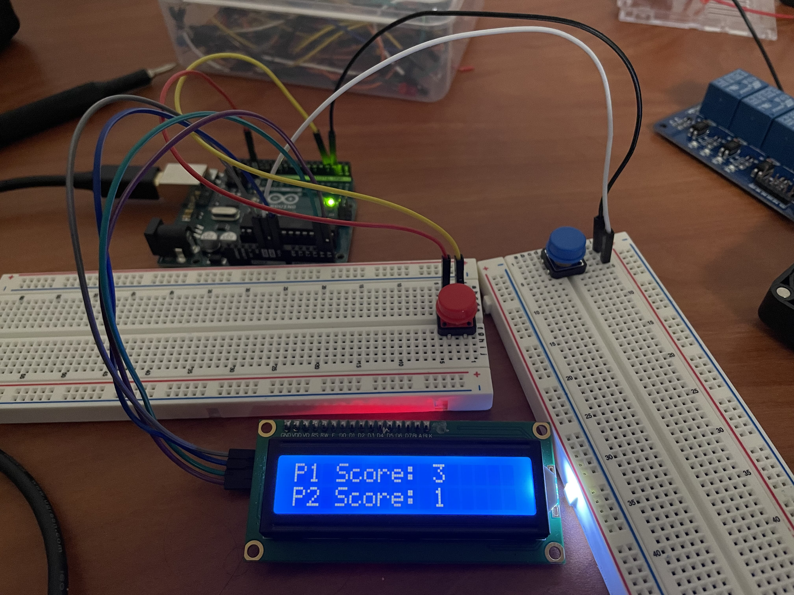
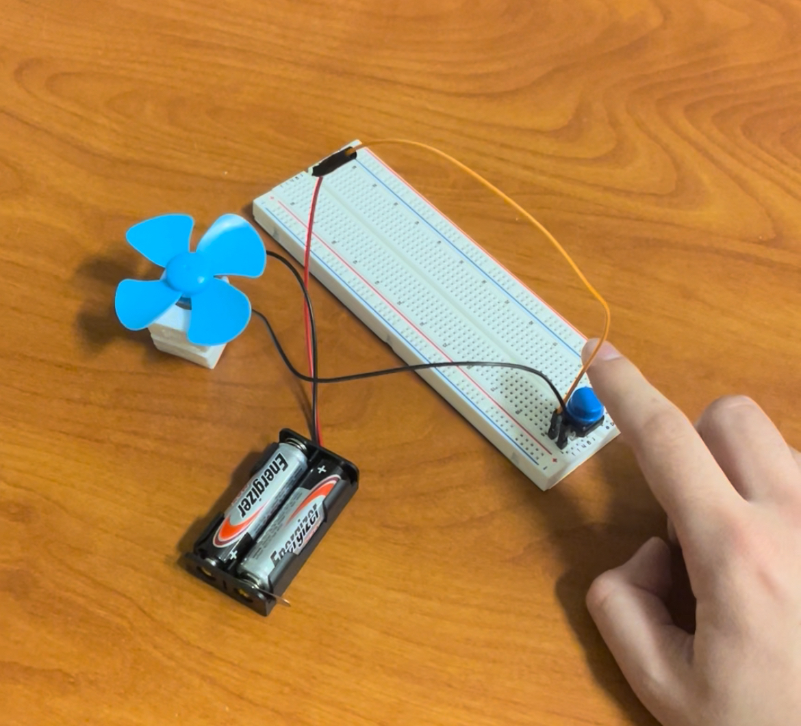
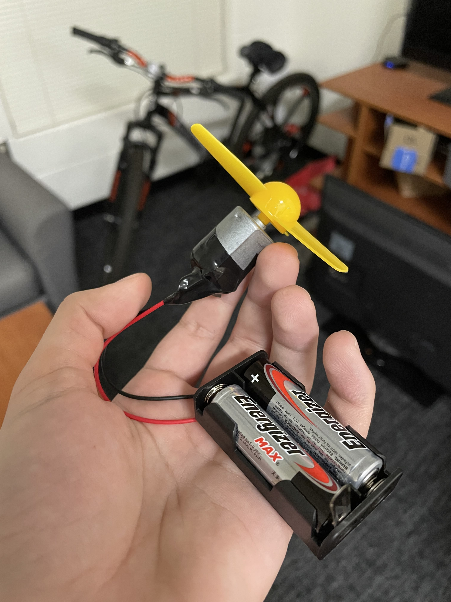

# Two Player Pinball
This is the electrical side of our project, Two Player Pinball.

# Setup

## Materials Required
- Electrical Tape
- AA Batteries
- AA Battery Compartment
- Dupont Cables

### Score Counter
- Arduino R3 Uno
- Dupont Cables
- Two Buttons (one red and one blue)
- LCD (i2c 1602)
- Power Source

### Player-Controlled Fans
- Two Motors
- Two Fan Heads (one red and one blue)
- Two Buttons (one red and one blue)

### Spinner 
- Motor
- Slender Fan Head

## Score Counter
1. Connect the pins from the LCD to the Arduino as follows:
```
GND -> GND
VCC -> VIN
SDA -> A4
SCL -> A5
```
2. Connect one side of the player 1 button to ground, and connect the other side to Pin 2 on the Arduino.
3. Repeat step 2 with the player 2 button, except connect the second cable to Pin 3 on the arduino.
4. Flash the code provided in [score_counter.ino](score_counter.ino) onto the Arduino.
5. Provide a power source, such as a power bank.



## Player-Controlled Fans
Repeat these steps to create a second player-controlled fan.

1. Attach a fan head to the motor.
2. Wire the negative cable from the battery compartment to the motor.
3. Connect the positive cable from the battery compartment to the button.
4. Strip the ends of a dupont cable and attach one end to the motor and the other end to the button so that the button exists as an opening in the circuit.
5. Fill battery compartment with batteries and close the switch to make the circuit active. The fan will be on while the button is pressed.



## Spinner
1. Attach the slender fan head to a Motor.
2. Connect motor directly to battery compartment.
3. Fill battery compartment with batteries and close the switch to activate.


